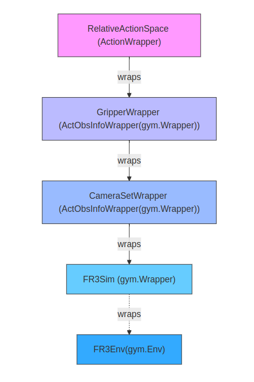
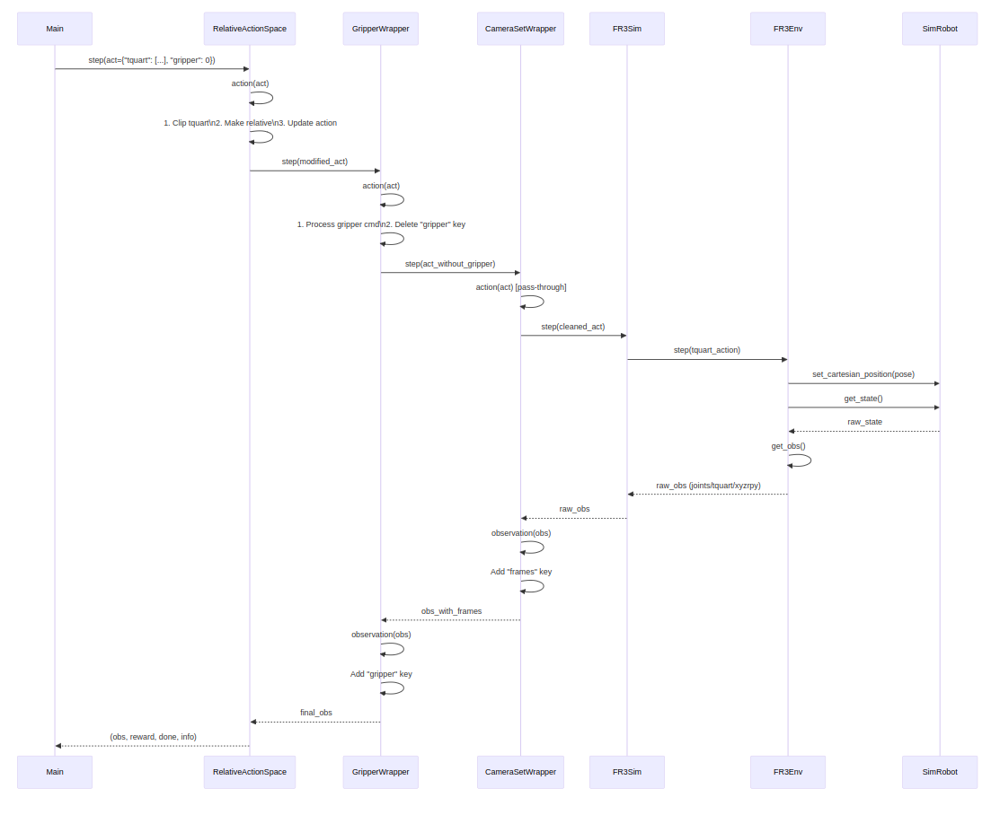

# Action-Observation Flow 

## wrapper Hierarchy 


Vertical Order:

- Top: Highest-level wrapper (first applied)

- Bottom: Base environment

Inheritance Notation:

- Use (ParentClass) next to wrapper names

Wrapping Notation

- Show ← wraps arrows between layers
<p align="center">
  
</p>

## Flow
1. **`RelativeActionSpace(ActionWrapper).step(act)`**
   
   -   2- Calls step function of ActionWrapper (→2)

2. **`ActionWrapper.step(act)`**
   - 3. Calls `RelativeActionSpace.action(act)`
   - 4. Calls `GripperWrapper.step(act)`

3. **`RelativeActionSpace.action(act)`**
   - Processes action: `{"tquart": [0.01, 0, 0, 0, 0, 0, 1], "gripper": 0}`
   - Operations:
     - Clips action within min/max limits
     - Makes action relative (current_pose + action)
     - Updates `action["tquart"]`

4. **`GripperWrapper(ActObsInfoWrapper).step(act)`**
   - →5. Calls `GripperWrapper.action(act)`
   - →6. Calls `CameraSetWrapper.step(act)`
   - →15. Calls `GripperWrapper.observation(obs)`

5. **`GripperWrapper.action(act)`**
   - Uses `act["gripper"]` to open/close gripper
   - Only executes if state change needed
   - Deletes `"gripper"` key from action dict

6. **`CameraSetWrapper(ActObsInfoWrapper).step(act)`**
   - →7. Calls `CameraSetWrapper.action(act)`
   - →8. Calls `CameraSetWrapper(ActObsInfoWrapper).step(act)`
   - →14. Calls `CameraSetWrapper.observation(obs)`

7. **`CameraSetWrapper.action(act)`**
   - (Pass-through) Returns original action

8. **`CameraSetWrapper(ActObsInfoWrapper).step(act)`**
   - →9. Calls `CameraSetWrapper.action(act)`
   - →10. Calls `FR3Sim.step(act)`

9. **`CameraSetWrapper.action(act)`**
   - (Pass-through) Returns original action

10. **`FR3Sim.step(act)`**
    - →11. Calls `FR3Env.step(act)`
    - 13. Executes:
      ```python
      self.sim.step_until_convergence()
      state = self.sim_robot.get_state()
      ```
    - Returns observation

11. **`FR3Env.step(act)`**
    - Sets new pose:
      ```python
      self.robot.set_cartesian_position(
          common.Pose(
              translation=action_dict[self.tquart_key][:3],
              quaternion=action_dict[self.tquart_key][3:]
          )
      )
      ```
    - →12. Calls `FR3Env.get_obs()`

12. **`FR3Env.get_obs()`**
    - Returns:
      ```python
      (
          tquart=np.concatenate([
              self.robot.get_cartesian_position().translation(),
              self.robot.get_cartesian_position().rotation_q()
          ]),
          joints=self.robot.get_joint_position(),
          xyzrpy=self.robot.get_cartesian_position().xyzrpy()
      )
      ```
    - Shapes:
      - `joints`: (7,)
      - `tquart`: (7,) [x,y,z, qx,qy,qz,qw]
      - `xyzrpy`: (6,) [x,y,z, roll,pitch,yaw]

14. **`CameraSetWrapper.observation(obs)`**
    - Adds camera data:
      ```python
      {
          ...original_obs...,
          "frames": {
              "wrist": {
                  "rgb": (256,256,3),
                  "depth": (256,256,3)
              },
              "default_free": {
                  "wrist": {
                      "rgb": (256,256,3),
                      "depth": (256,256,3)
                  }
              }
          }
      }
      ```

15. **`GripperWrapper.observation(obs)`**
    - Adds gripper state:
      ```python
      {
          ...previous_data...,
          "gripper": float
      }
      ```
# Sequence Diagram


