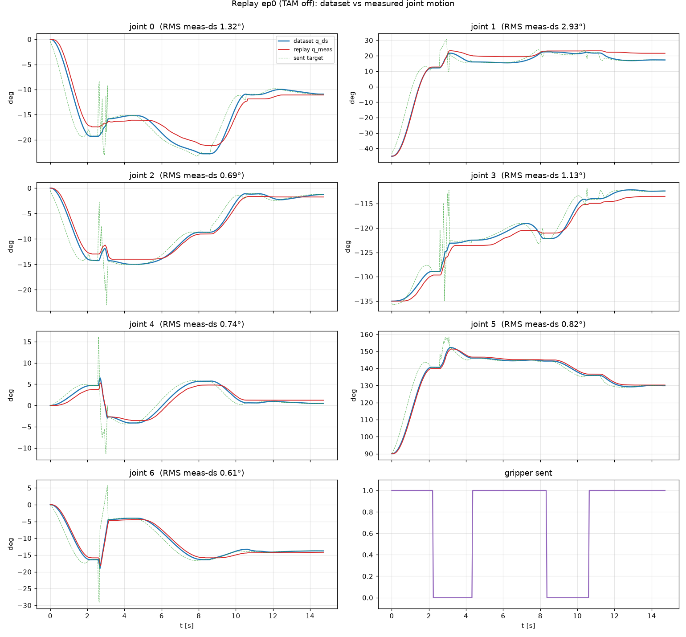
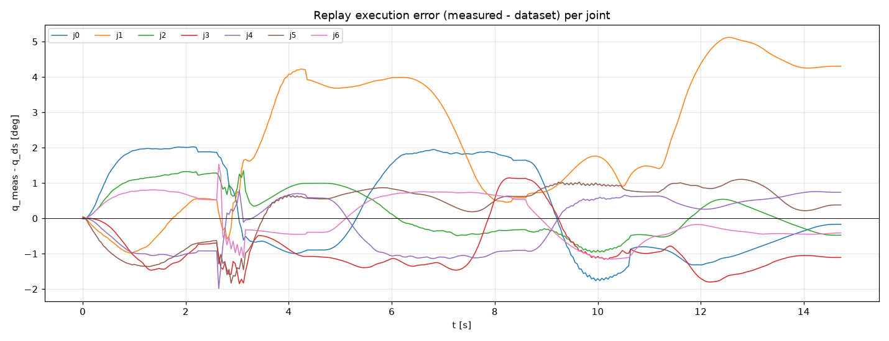
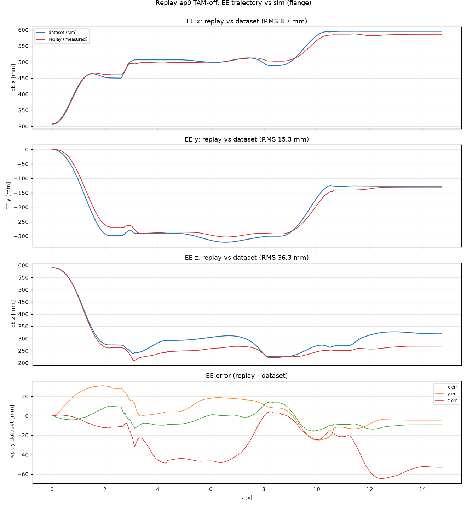
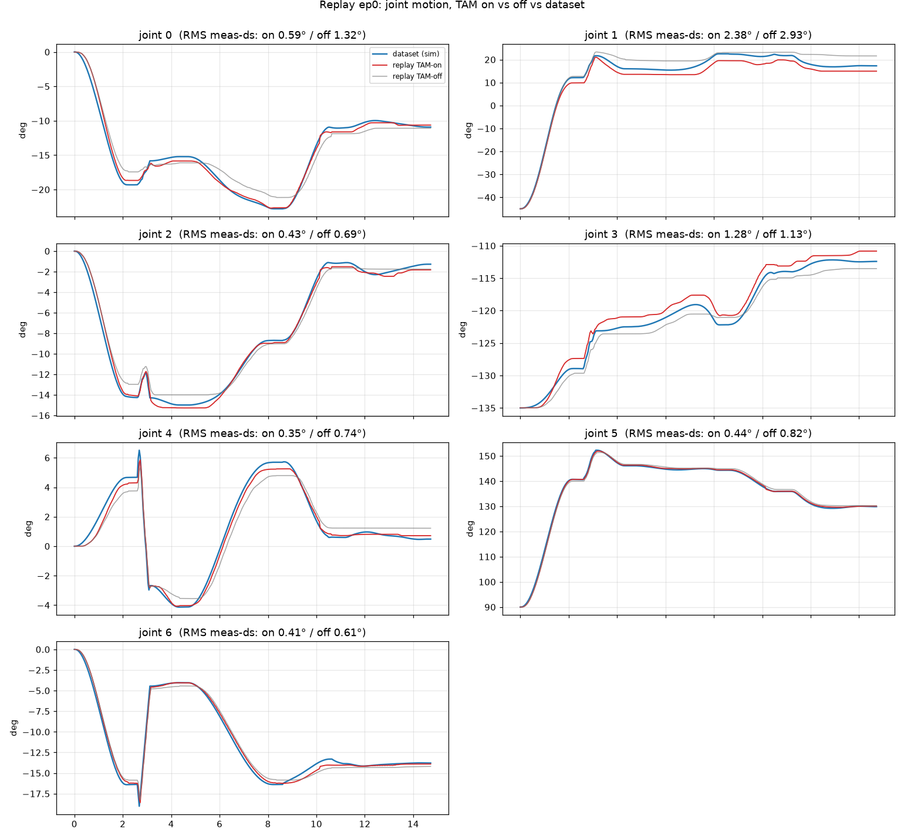
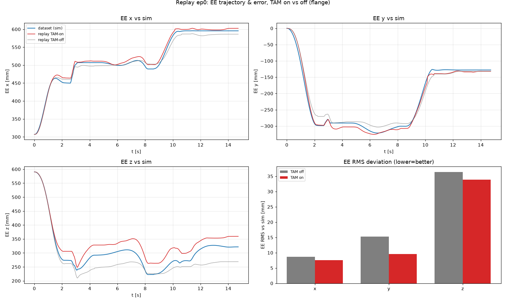
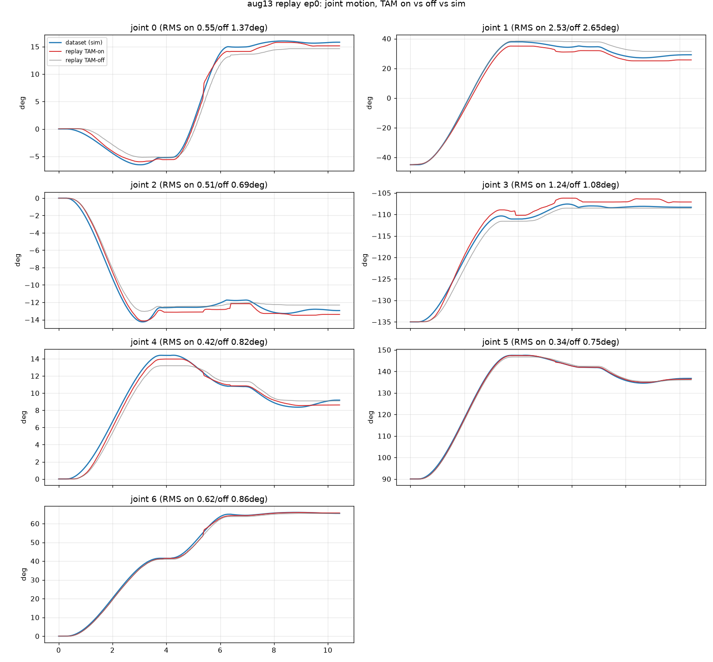
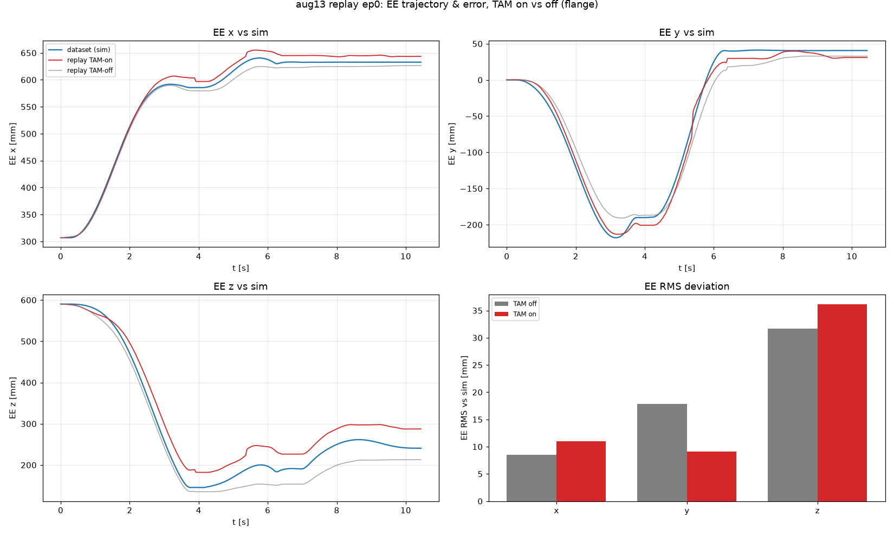
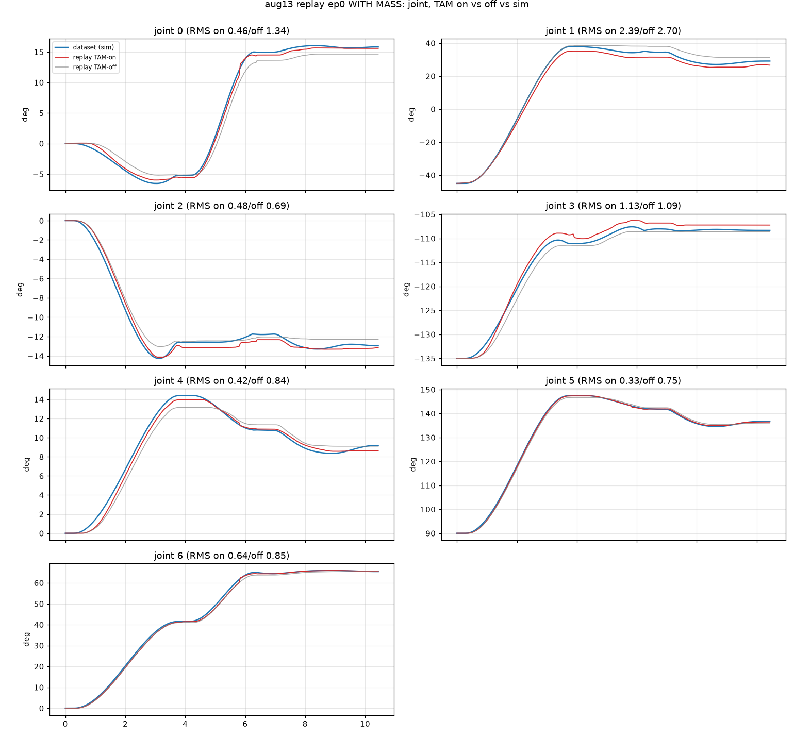
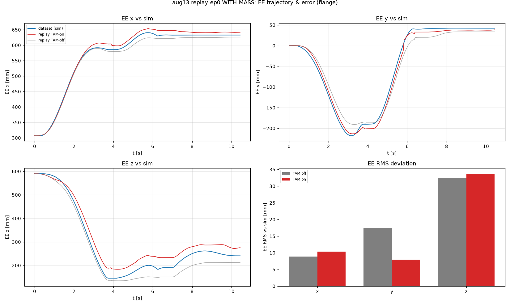

# Dataset Replay Report

**Purpose:** isolate **policy vs. execution** for the "cube not grasped, arm too
high" failure. We replay the *exact recorded joint targets* from a training
episode (no policy in the loop) and compare what the robot measures against what
the dataset recorded.

- If replay-measured motion **matches** the dataset recording (and the cube is
  grasped) → execution/sim2real is faithful → the failure is in the **policy**.
- If the replay itself **diverges** (e.g. ends too high) → the gap is in
  **execution** (sim2real dynamics) → then re-run replay with TAM on to see if
  it closes that specific deviation.

## Setup

| | |
| --- | --- |
| Dataset | `~/dataset/compliant_test_flip_pnp_softer/blocks_success` |
| Control | joint PD, **soft** `kp=40, kd=13` (pd_mode=0, matches the dataset) |
| Command | `action.joint_target` (absolute rad), replayed at 25 fps |
| Clamp | `max_relative_movement = 20°` (targets jump up to ~21°/step; see notes) |
| Gripper | inverted (dataset 0/1 → live 0=closed/1=open) |
| TAM | **off** for the first pass (bare execution gap), then on |
| Script | `examples/inference/franka_replay.py` |
| Plot | `examples/inference/plot_replay.py` |

## Data notes (from loading episode 0)

- 370 frames (14.8 s). `pd_mode` is all-0 (soft) as expected.
- **The terminal frame has `action.is_valid=False` and a garbage target**
  (130° jump on J4/J6) — dropped by the loader.
- Recorded **targets jump up to ~21°/step** while the recorded **observed motion
  is ≤1.8°/step** — the compliant controller ran heavily error-saturated (target
  far ahead, arm lagging). The 20° clamp therefore barely engages (~1 frame).

## How to reproduce

```bash
# TAM off (bare execution gap):
python examples/inference/franka_replay.py
# then plot dataset vs measured:
python examples/inference/plot_replay.py tam_logs/<ts>

# TAM on (does it close the gap?): set ReplayConfig.tam = True, re-run, re-plot.
```

Outputs per run in `tam_logs/<ts>/`:
`replay_frames.csv` (per-frame `q_sent`/`q_meas`/`q_ds` + gripper),
`replay_{tam,notam}_controller_1khz.csv` (1 kHz controller/TAM detail),
`replay_meta.json` (episode/config provenance), `replay_compare.png` (the plot).

---

## Results — episode 0, TAM off (`20260821_161209`)

**The dataset is SIMULATION** (TAMP planner: `outputs/compliant_test/flip_then_pnp`,
domain/problem PDDL, per-episode domain-randomization metadata). So `q_ds` is the
sim-achieved motion and `q_meas` is the real robot running the same targets —
**this replay measures the sim2real execution gap directly**, with TAM off.

369 frames, 14.7 s.

### Joint space — replay tracks the sim joint trajectory to a few degrees

RMS(`q_meas` − `q_ds`) per joint [deg]:

| j0 | j1 | j2 | j3 | j4 | j5 | j6 |
| --- | --- | --- | --- | --- | --- | --- |
| 1.32 | **2.93** | 0.69 | 1.13 | 0.74 | 0.82 | 0.61 |

max │`q_meas` − `q_ds`│ per joint [deg]: `[2.0, 5.1, 1.4, 1.9, 2.0, 1.8, 1.5]`
(worst is J1, the shoulder).




### EE space — small joint errors amplify to grasp-relevant cm-level EE error

Forward kinematics (FR3, **flange** frame — matches the dataset EE convention
and the robot's `tcp_offset=identity`) of `q_meas` vs `q_ds`:

| axis | RMS [mm] | max │·│ [mm] |
| --- | --- | --- |
| x | 8.7 | 16.0 |
| y | 15.3 | 31.0 |
| **z (height)** | **36.3** | **64.7** |

Mean EE-Z(`replay` − `sim`) = **−29.7 mm** (replay runs ~3 cm *lower* on average),
but the vertical error swings up to **6.5 cm** peak.



### Verdict

- **Execution is NOT grasp-faithful.** Even replaying the planner's exact
  targets, the real robot's EE deviates from the sim by up to **6.5 cm
  (36 mm RMS), dominated by the vertical axis** — comparable to a cube's size, so
  enough to miss a grasp. The gap is small in joint space (1–3°) but amplifies
  through the kinematics.
- This is precisely the **sim2real execution gap TAM is meant to close**, and it
  is present with **TAM off**. So the "arm too high / cube not grasped" symptom
  is at least partly an **execution** problem, not purely the policy. (Note the
  sign: this replay averages ~3 cm *lower* than sim; the live policy looked
  *higher* — the two aren't directly comparable since the policy commands its own
  targets, but both point to an uncorrected vertical execution error.)

## Results — episode 0, TAM on (`20260821_162326`) vs off

Same episode, TAM enabled (stable config: `tam_residual_clip=[…,0.5,0.5,0.5]`,
`rate_limit=True`, `tam_history_pre_ratelimit=True`). TAM ran **stably** through
the whole replay: `active=0.97`, OOD max **2.3σ**, wrist J7 `dq` ≤0.73 rad/s,
latent age median 99 ms — no limit cycle.

### TAM improves joint tracking and EE x/y…

Joint RMS(`q_meas`−`q_ds`) [deg]:

| | j0 | j1 | j2 | j3 | j4 | j5 | j6 |
| --- | --- | --- | --- | --- | --- | --- | --- |
| TAM off | 1.32 | 2.93 | 0.69 | 1.13 | 0.74 | 0.82 | 0.61 |
| **TAM on** | **0.59** | **2.38** | **0.43** | 1.28 | **0.35** | **0.44** | **0.41** |

EE deviation from sim [mm] (flange frame):

| axis | RMS off | RMS on | max off | max on |
| --- | --- | --- | --- | --- |
| x | 8.7 | **7.6** | 16.0 | **14.2** |
| y | 15.3 | **9.6** | 31.0 | **21.8** |
| z | 36.3 | **33.9** | 64.7 | **51.9** |
| 3D | 40.4 | **36.0** | | |

TAM improves the **y** error (~37%), modestly improves x and the 3D total, and
improves joint tracking on 6 of 7 joints — evidence it is closing part of the
sim2real dynamics gap, and doing so stably.

### …but it does NOT fix the vertical (grasp-critical) axis — it overcorrects it

The Z RMS barely moves (36→33 mm), and the **mean EE-Z bias flips sign**:

| | mean EE-Z (replay − sim) |
| --- | --- |
| TAM off | **−29.7 mm** (arm ~3 cm too *low*) |
| TAM on | **+31.5 mm** (arm ~3 cm too *high*) |

So TAM adds ~+60 mm of vertical correction and **overshoots** — turning a 3 cm
*undershoot* into a 3 cm *overshoot*. **This matches the observed live symptom
("arm too high, cube not grasped"):** with TAM on, the EE sits ~3 cm above where
the sim demo put it, which is enough to miss the cube.




### Verdict

- **TAM works and is stable** — it closes the dynamics gap in joint space and in
  EE x/y, without reigniting the wrist instability.
- **The grasp failure is a persistent ~3 cm vertical bias, not a TAM stability
  problem.** Both directions show a ~30 mm systematic EE-Z offset; TAM flips its
  sign (over-corrects) rather than removing it. A constant few-cm vertical bias
  that survives in both cases smells like a **calibration/model offset**, not a
  dynamics gap TAM can learn away.

### Next steps

1. **Chase the ~3 cm vertical bias directly** (independent of TAM): check the
   **TCP offset / gripper mounting**, the **payload/load mass** used for gravity
   compensation, the **FK model vs. real** (this Z error appears in the bare
   soft controller too), and **table-height** calibration. A constant offset here
   would explain both signs.
2. **Understand TAM's vertical overshoot** — it adds ~2× the needed Z
   correction. Consider whether the shoulder/elbow (J1/J3, which drive EE-Z)
   residuals are too aggressive; a per-joint scale on those could center the Z
   error near zero.
3. Confirm grasp timing given the **inverted gripper** before attributing
   remaining failures.

> Caveat: gripper was replayed **inverted** (dataset→live convention); confirm
> open/close timing before trusting grasp outcome. EE numbers are FK (FR3 +
> Robotiq 2F-85 TCP) of measured vs. sim joints — a wrong TCP offset would bias
> the EE-Z comparison itself (see step 1).

---

# Dataset 2 — `aug13_sim2real_kp40_pnp` (pnp-only, kp40, sim)

Same two experiments on a second **simulation** dataset (pnp-only task, soft
kp40). Episode 0, 262 frames. Baseline `20260821_163425` (TAM off, rerun after
the first attempt drove into the table), TAM-on `20260821_163735`.

TAM-on ran **stably**: `active=0.95`, OOD max **1.8σ**, wrist J7 `dq` ≤0.58 rad/s,
latent age median 96 ms — no limit cycle (wrist clip config unchanged).

## The vertical-overshoot finding reproduces

Joint RMS(`q_meas`−`q_ds`) [deg] — TAM improves 6 of 7 joints:

| | j0 | j1 | j2 | j3 | j4 | j5 | j6 |
| --- | --- | --- | --- | --- | --- | --- | --- |
| TAM off | 1.37 | 2.65 | 0.69 | 1.08 | 0.82 | 0.75 | 0.86 |
| **TAM on** | **0.55** | **2.53** | **0.51** | 1.24 | **0.42** | **0.34** | **0.62** |

EE deviation from sim [mm] (flange):

| axis | RMS off | RMS on | max off | max on |
| --- | --- | --- | --- | --- |
| x | 8.5 | 11.0 | 17.0 | 19.2 |
| y | 17.8 | **9.1** | 29.7 | **16.4** |
| z | 31.7 | 36.1 | 52.0 | 50.6 |
| 3D | 37.3 | 38.8 | | |

**Mean EE-Z bias flips sign again — same as dataset 1:**

| | mean EE-Z (replay − sim) | EE-Z bottoms out at |
| --- | --- | --- |
| TAM off | **−27.7 mm** (too *low*) | 135 mm — **10 mm below sim (145 mm) → into the table** |
| TAM on | **+31.9 mm** (too *high*) | 182 mm — **37 mm above sim → cannot reach the cube** |




## Cross-dataset conclusion

The vertical execution bias and TAM's response are **consistent across both
datasets**:

| | compliant_test | aug13_kp40_pnp |
| --- | --- | --- |
| mean EE-Z, TAM off | −29.7 mm (low) | −27.7 mm (low) |
| mean EE-Z, TAM on | +31.5 mm (high) | +31.9 mm (high) |

- **TAM off → arm ~3 cm too low** (drives into the table on the pnp dataset).
- **TAM on → arm ~3 cm too high** (bottoms out 37 mm above sim → misses the
  cube). This is exactly the live "arm too high, cube not grasped" symptom.
- TAM reliably improves joint tracking and the **y** axis and stays stable, but
  it **over-corrects the vertical axis by ~2×**, converting a −3 cm undershoot
  into a +3 cm overshoot rather than centering it. On aug13 the net EE 3D RMS is
  even slightly worse (37.3→38.8 mm) because the z overshoot dominates and x
  worsens.

**The blocker is a systematic ~3 cm vertical offset, seen with TAM off, that TAM
flips instead of removes.** This is very likely a **calibration/model** issue
(TCP/flange, payload/gravity comp, FK-vs-real, or table-height), not something
TAM can learn away — pursue the vertical-bias hunt (report step 1) before
expecting TAM to fix the grasp. A per-joint down-scale on the shoulder/elbow
(J1/J3) residuals that drive EE-Z could also stop TAM from overshooting.

---

# Dataset 2 with added payload — block mass in gripper

Same aug13 ep0 replay, but with a physical **block placed in the gripper** to add
mass. TAM off `20260821_164347`, TAM on `20260821_164438`. (Note: the replay does
not call `setLoad`, so the controller's gravity compensation does **not** know
about the block — an unmodeled payload.)

EE-Z bias, with vs without the added mass:

| run | mean EE-Z (replay − sim) | EE-Z bottoms at | joint RMS J1 [deg] |
| --- | --- | --- | --- |
| no-mass, TAM off | −27.7 mm | 135 mm | 2.65 |
| **mass, TAM off** | **−28.3 mm** | 135 mm | 2.70 |
| no-mass, TAM on | +31.9 mm | 182 mm | 2.53 |
| **mass, TAM on** | **+29.7 mm** | 184 mm | 2.39 |

TAM-on with mass stayed **stable** (OOD max 1.8σ, J7 `dq` ≤0.58, active 0.95).




## Finding — the vertical bias is payload-independent

Adding the block **did not change** the results: EE-Z bias, the bottom-out
height, and per-joint tracking are all within noise of the no-payload runs
(off −28.3 vs −27.7 mm; on +29.7 vs +31.9 mm).

This is an informative **negative result**. If the ~3 cm vertical offset were
driven by an **unmodeled payload / gravity-compensation** error, adding a block
(which the controller's gravity comp ignores) should have made the soft arm sag
noticeably *lower* with TAM off. It did not. So:

- **The ~3 cm vertical bias is NOT a gravity/load-modeling problem** — it is
  robust to payload.
- That points the calibration hunt (report step 1) toward a **payload-independent
  kinematic/model offset**: TCP/flange definition, FK-model-vs-real, mounting, or
  table-height reference — rather than load mass or gravity compensation.
- TAM's vertical **overshoot to ~+3 cm reproduces with payload too**, unchanged.
