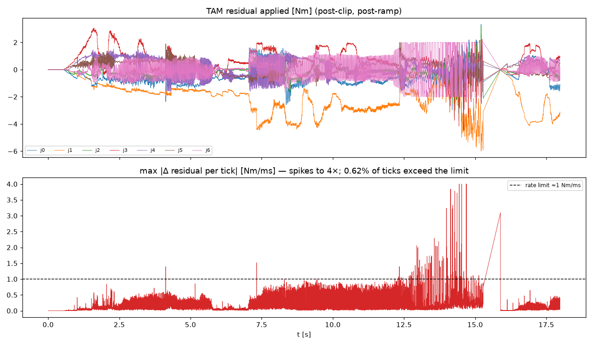
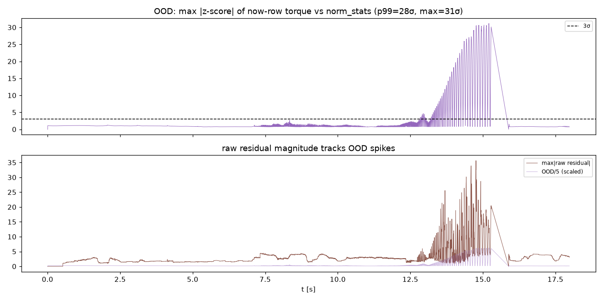
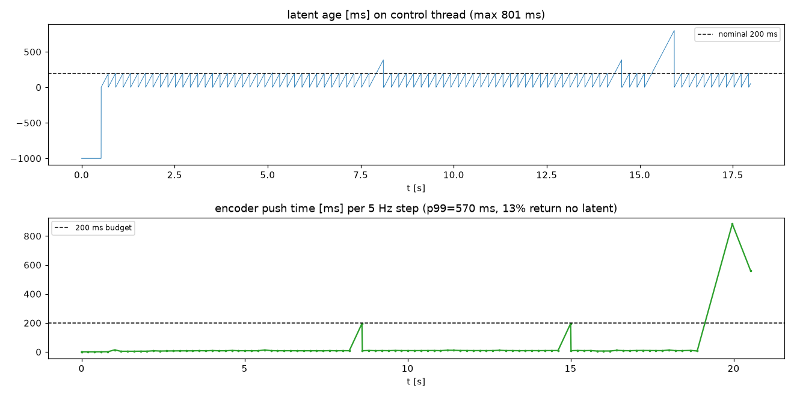
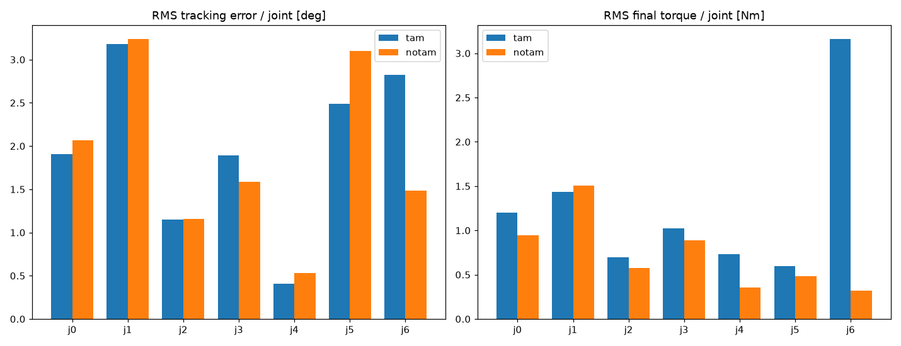
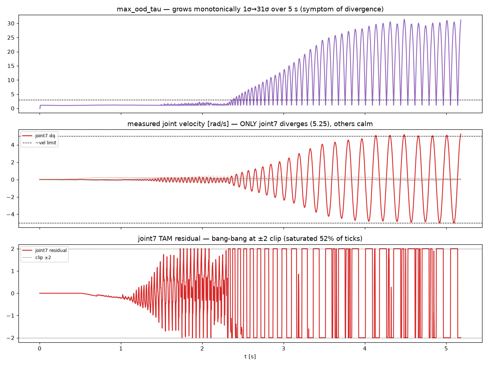
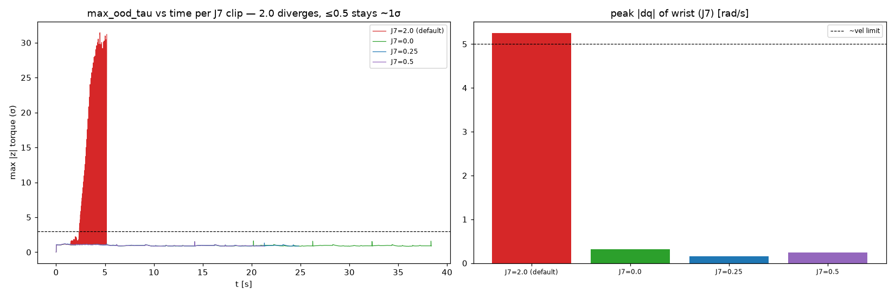

# TAM Integration Debug Report

**Date:** 2026-08-21
**Robot:** FR3 (right), joint PD controller, soft gains `kp=40, kd=13` (policy trained for `pd_mode=0`)
**Task:** pick-and-place ("pick up the green cube")
**Checkpoint:** default multirobot TAM (applied-torque mode), `history_steps=8`, latent dim 448

## Runs analyzed

| Run | Log | Duration | Ticks |
| --- | --- | --- | --- |
| TAM on | `20260821_140946/tam_controller_1khz.csv` (+ encoder log) | 18.0 s | 17 377 |
| TAM off (baseline) | `20260821_141247/notam_controller_1khz.csv` | 11.6 s | 11 615 |

TAM was genuinely active during the TAM run (`model_present=1.00`, `window_ok=1.00`, `active=0.97`, ramp reached 1.0).

---

## TL;DR

TAM does **not** help here and actively destabilizes the wrist. The failure is **not** a gains or gravity problem — it is the **history-encoder latent pipeline**:

1. **The JAX encoder stalls badly** — push times hit **570 ms (p99) / 883 ms (max)**, and **13 % of pushes return no latent**, so the control thread runs on a latent that is up to **800 ms stale**.
2. When a fresh latent finally lands after a stall, the residual **steps discontinuously** — up to **4 Nm/ms**, 4× the 1 kHz torque-rate limit. Rate-limiter-on → oscillation; rate-limiter-off → torque-discontinuity fault.
3. The soft `kp=40` regime drives the torque history **wildly out-of-distribution intermittently** (up to **31σ**), where the MLP extrapolates into large residuals.
4. Net effect vs baseline: **no tracking improvement on average, and the wrist (joint 6) gets clearly worse** (RMS error 2.82° vs 1.48°, RMS torque 3.16 Nm vs 0.32 Nm), consistent with its 2 Nm residual clip saturating 10.6 % of the time.

---

## Finding 1 — Residual is discontinuous beyond the rate limit



The applied residual reaches **6 Nm** (joint 1) and its **per-tick change peaks at 4.0 Nm/ms**. The 1 kHz torque-rate limit is ~1 Nm/ms; **0.62 % of ticks** (≈108 ticks) demand a faster change than allowed.

- Rate-limiter **on**: these steps get smeared over several ticks → the EE oscillation you observed, eventually a velocity-limit violation.
- Rate-limiter **off**: the step is passed straight through → immediate torque-discontinuity reflex.

Max applied residual per joint [Nm]: `[3.33, 5.99, 3.72, 4.51, 1.64, 2.00, 2.00]` (joints 5–6 pinned at their 2 Nm clip).

## Finding 2 — Inputs go intermittently out-of-distribution (up to 31σ)



`max_ood_tau` = max over joints of the z-score of the newest torque row vs the checkpoint's `norm_stats`:

| metric | value |
| --- | --- |
| median | 0.97σ (fine) |
| p99 | **27.7σ** |
| max | **31.1σ** |

So *most* of the time the torque history is in-distribution, but it **spikes to 30σ**. The raw residual magnitude tracks these spikes (lower panel) — the MLP is extrapolating exactly where inputs are OOD. The soft `kp=40` regime is at the low edge of the training `kp` distribution, and contact/gripper events push the instantaneous torque far past anything seen in training.

## Finding 3 — Latent staleness: the encoder can't keep up (root trigger)



The 5 Hz history encoder is the bottleneck:

| metric | value |
| --- | --- |
| push time median | 8 ms |
| push time **p99** | **570 ms** |
| push time max | 883 ms |
| pushes returning **no latent** | **13 %** |
| control-thread latent age median | 99 ms |
| control-thread latent age **max** | **801 ms** |

During an 800 ms stall the residual is computed against an increasingly stale context while the arm keeps moving (feeding Finding 2), and the moment the new latent lands the conditioning jumps (feeding Finding 1). **This staleness plausibly drives both other findings.** The likely causes are JAX recompiles on varying input shapes, GPU contention, and/or the 4 s attention-window cost. The C++ side currently uses whatever latent is present regardless of its age.

## Finding 4 — TAM vs baseline: no tracking benefit, wrist worse



RMS tracking error / joint [deg]:

| | j0 | j1 | j2 | j3 | j4 | j5 | **j6** |
| --- | --- | --- | --- | --- | --- | --- | --- |
| **tam** | 1.91 | 3.18 | 1.15 | 1.89 | 0.40 | 2.49 | **2.82** |
| **notam** | 2.06 | 3.24 | 1.16 | 1.58 | 0.53 | 3.10 | **1.48** |

RMS final torque / joint [Nm]:

| | j0 | j1 | j2 | j3 | j4 | j5 | **j6** |
| --- | --- | --- | --- | --- | --- | --- | --- |
| **tam** | 1.20 | 1.44 | 0.70 | 1.03 | 0.73 | 0.59 | **3.16** |
| **notam** | 0.95 | 1.51 | 0.58 | 0.89 | 0.35 | 0.48 | **0.32** |

TAM is a wash on the big joints (j0–j5: marginal wins and losses within noise) and **clearly hurts the wrist (j6)**: 2× the tracking error and ~10× the RMS torque — the joint whose residual clip saturates 10.6 % of the time. *(Caveat: the two runs have different durations and non-identical trajectories, so treat small per-joint differences as noise; the wrist blow-up is well outside noise.)*

---

## Ruled out

- **Gravity convention** — median gravity torque `[0, -29.6, 0.2, 20.0, 0.5, 2.6, 0] Nm` has correct magnitude and sign for the Franka at this config; model-space torque (`tau_cmd + gravity`) is consistent between C++ and the encoder.
- **Control-loop timing** — the 1 kHz loop itself is healthy: compute median 39 µs, p99 75 µs, max 182 µs. The stalls are in the Python/JAX encoder, not the RT loop.

## To verify

- **Window dt** — the direct-MLP window is 8 samples spanning **~7 ms** (raw 1 ms control spacing). Confirm the checkpoint's `history_steps` window was trained at 1 ms spacing; if training used a coarser dt, the window is physically wrong even though the shapes match.

---

## Root-cause synthesis

```
encoder stall (570 ms push, 13% empty)
        │
        ▼
latent up to 800 ms stale ──► on refresh, conditioning jumps
        │                              │
        ▼                              ▼
soft kp=40 → 30σ OOD torque ──► MLP extrapolates ──► residual steps 4 Nm/ms
                                                          │
                                    ┌─────────────────────┴───────────────────┐
                                    ▼                                          ▼
                        rate-limiter ON: oscillation            rate-limiter OFF: torque-discontinuity fault
```

## Recommended next steps (highest leverage first)

1. **Make the encoder real-time or decouple it.** Pre-warm the JAX compile cache with deployment-shaped inputs (`scripts/deploy/prepare_history_encoder_cache.py`), pin it to a dedicated/uncontended GPU, and keep input shapes fixed to avoid recompiles. Target push time well under the 200 ms budget with 0 % empties.
2. **Reject stale latents on the C++ side.** If `latent_age` exceeds a threshold (e.g. > 250 ms), hold the last residual or ramp to zero instead of applying a residual against stale conditioning. This alone should stop the post-stall jumps.
3. **Slew-limit the residual itself.** Apply a torque-rate limit to `delta` before adding it (independent of the global `limitRate`), so no single latent update can step the command faster than the actuator allows.
4. **Address OOD.** Correlate the 30σ spikes with gripper/contact events (overlay gripper state). If they coincide with contact, gate the residual down during contact; more fundamentally, the `kp=40` regime may be under-represented in the checkpoint — consider a checkpoint/finetune covering these gains.
5. **Re-evaluate after 1–3.** Only once the residual is smooth and latent-fresh does the "does TAM close the tracking gap" question become answerable; today the pipeline artifacts dominate.

## Reproduce

```bash
# single-run diagnostic
python examples/inference/plot_tam_log.py tam_logs/20260821_140946
# tam vs notam comparison
python examples/inference/plot_tam_log.py tam_logs/20260821_140946 tam_logs/20260821_141247
```

---

# Update — Resolution (2026-08-21, later)

After the initial report we ran a sequence of controlled experiments. The
oscillation is now **resolved** and TAM runs stably; the motion qualitatively
matches the motion planner used to collect the training data.

## What was tried, and what each result told us

| # | Change | Result | Conclusion |
| --- | --- | --- | --- |
| 1 | **Encoder warmup** (compile all JAX paths before the robot moves) | `latent_age` max 800 ms → ~200 ms; encoder median 8 ms | Fixed the latency blowups. Oscillation persisted → latency was **not** the root cause. |
| 2 | **`rate_limit=False`** (remove `franka::limitRate`) | Immediate `controller_torque_discontinuity` at 1.9 s | Can't run without it: PD+residual **sum** exceeds FCI's ~1 Nm/ms reflex (45 ticks) even when neither term alone does. |
| 3 | **Decouple TAM history from the limiter** (`tam_history_pre_ratelimit=True`: record pre-limit intended torque, keep limiter on for FCI) | Still diverged to 31σ OOD + `joint_velocity_violation` at ~5 s | **Rate limiter ruled out** as the cause. The divergence is not a limiter-feedback artifact. |
| 4 | **Choke wrist residual clip** `tam_residual_clip=[10,10,10,10,0.5,0.5,0.0]` | **Stable for 38 s**, OOD ≤1.6σ, all `dq` ≤0.32 rad/s | Root cause identified: a self-excited limit cycle on the wrist. |
| 5 | **Nudge J7 back up**: clip 0.25, then 0.5 | Both **stable** (OOD ≤1.5σ, flat; J7 `dq` ≤0.25 rad/s) | Wrist authority is recoverable up to ≥0.5 Nm without reigniting. |

## Root cause: a single-joint limit cycle on the wrist (J7)

The divergence was **not** input-OOD, latency, or the rate limiter — those were
ruled out by experiments 1–3. It is a **closed-loop instability isolated to
joint 7** (wrist roll), the lowest-inertia / softest joint (`kp=40, kd=13`):

- With the default ±2 Nm clip, J7's residual went **bang-bang at the clip
  (saturated 52 % of ticks)**, pumping energy into the light wrist.
- Wrist velocity grew 0.3 → 5.25 rad/s over ~3 s; `max_ood_tau` climbed
  **monotonically 1σ → 31σ** as the state left the training manifold.
- OOD was the **symptom** of the divergence, not its trigger (it starts near 1σ
  and builds up; it is not a discrete task-phase event).



The **residual clip is the loop gain**: reducing J7's authority reduces the
energy injected per cycle. Below a threshold the wrist stays damped.



| J7 clip [Nm] | peak wrist \|dq\| [rad/s] | max OOD [σ] | outcome |
| --- | --- | --- | --- |
| 2.0 (default) | 5.25 | 31 | diverges → velocity fault |
| 0.0 | 0.32 | 1.6 | stable (38 s) |
| 0.25 | 0.15 | 1.5 | stable |
| 0.5 | 0.25 | 1.5 | stable |

Current stable config: `tam_residual_clip = [10, 10, 10, 10, 0.5, 0.5, 0.5]`,
`rate_limit=True`, `tam_history_pre_ratelimit=True`, warmup on. The big arm
joints (J1–J4) receive full residuals (up to ~±5 Nm); the wrist is limited to
±0.5 Nm.

## Current status

- **Stable and in-distribution** across full 20–38 s runs: OOD median ~0.9σ,
  max ≤1.6σ, 0 % of ticks above 3σ, no buildup.
- **Motion qualitatively matches the data-collection motion planner** — the
  sim2real gap TAM targets appears to be closed for the arm.
- **Open issue (not TAM-attributable yet):** the cube is **not grasped
  correctly — the arm ends too high**. It is unknown whether this comes from the
  policy or the execution. **Next step: replay training-data trajectories** on
  the robot to isolate policy vs. execution (method TBD in follow-up).

## Config knobs added during this investigation

- `tam_warmup` (+ `tam_warmup_target_ms` / `_streak` / `_timeout_s`) — pre-compile the encoder.
- `rate_limit` — toggle `franka::limitRate` (keep True for FCI).
- `tam_history_pre_ratelimit` — record pre-limiter torque into TAM history.
- `tam_residual_clip` — per-joint residual authority (the wrist-stability knob).
- 1 kHz controller debug log + 5 Hz encoder log + `plot_tam_log.py`.
